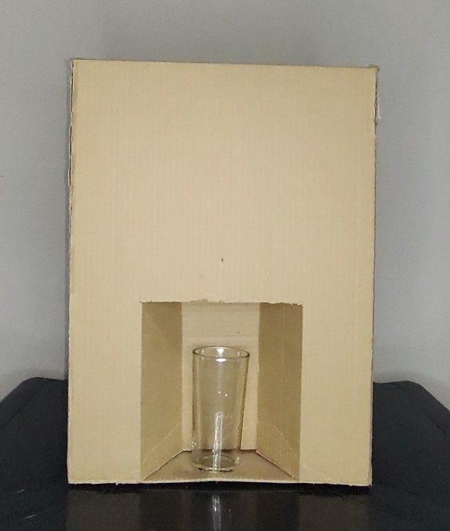
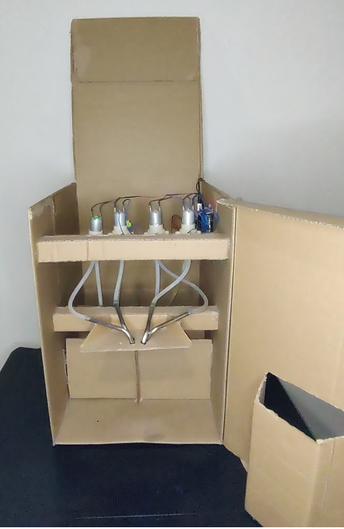
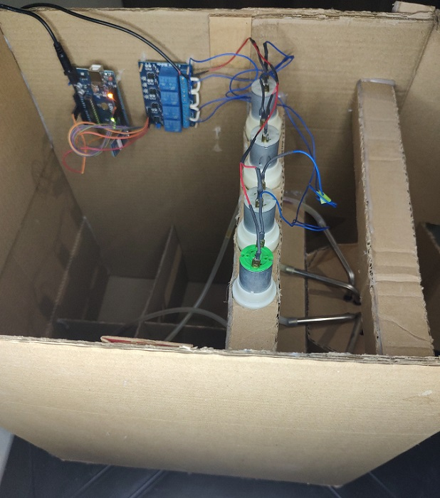

## 🍊 Juice Box – Máquina Inteligente de Sucos

A Juice Box é uma máquina automatizada de preparo e controle de sucos, desenvolvida com Arduino e componentes eletrônicos acessíveis.
O projeto integra hardware e software, oferecendo uma solução de baixo custo para instituições educacionais ou pequenos negócios que buscam controle eficiente do consumo de bebidas.

---

## ⚙️ Componentes Físicos

- Arduino Uno – microcontrolador responsável pelo controle geral.

- Módulo Relé – aciona as válvulas de forma segura.

- Válvulas Solenóides – responsáveis pelo fluxo e liberação dos sucos.

- Módulo Bluetooth HC-06 – comunicação com o aplicativo mobile.

- Fonte de Alimentação 12V – energia para o sistema.

- Estrutura Física – compartimento para reservatórios de suco, conexões hidráulicas e fixação dos componentes eletrônicos.

---

## 🔌 Ligações Elétricas (Arduino)

- Relé 1 → Válvula de Suco 1 (Pino 8 do Arduino)

- Relé 2 → Válvula de Suco 2 (Pino 9 do Arduino)

- Relé 3 → Válvula de Suco 2 (Pino 10 do Arduino)

- Relé 4 → Válvula de Suco 2 (Pino 11 do Arduino)

- HC-06 RX/TX → Comunicação Serial com Arduino (Pinos 0 e 1)

- Fonte 12V → Alimentação das válvulas e relés (com regulador para o Arduino)

---

## 🏗️ Estrutura Física

- A máquina foi montada em uma caixa reaproveitada (case de PC reciclado), oferecendo:

- Reservatórios de líquidos para cada sabor de suco.

- Conexões de mangueiras ligadas às válvulas solenóides.

- Painel de acesso interno para manutenção.

- Saída frontal para enchimento dos copos.

## 📷 Imagem da Juice Box

---

  

## 📌 Diferenciais

---

- Custo reduzido (aprox. R$ 180,00) em comparação com máquinas comerciais.

- Estrutura sustentável com reaproveitamento de materiais.

- Integração com aplicativo mobile (Kotlin) e aplicação web (Firebase).

- Fácil manutenção e possibilidade de expansão (mais válvulas e sabores).
